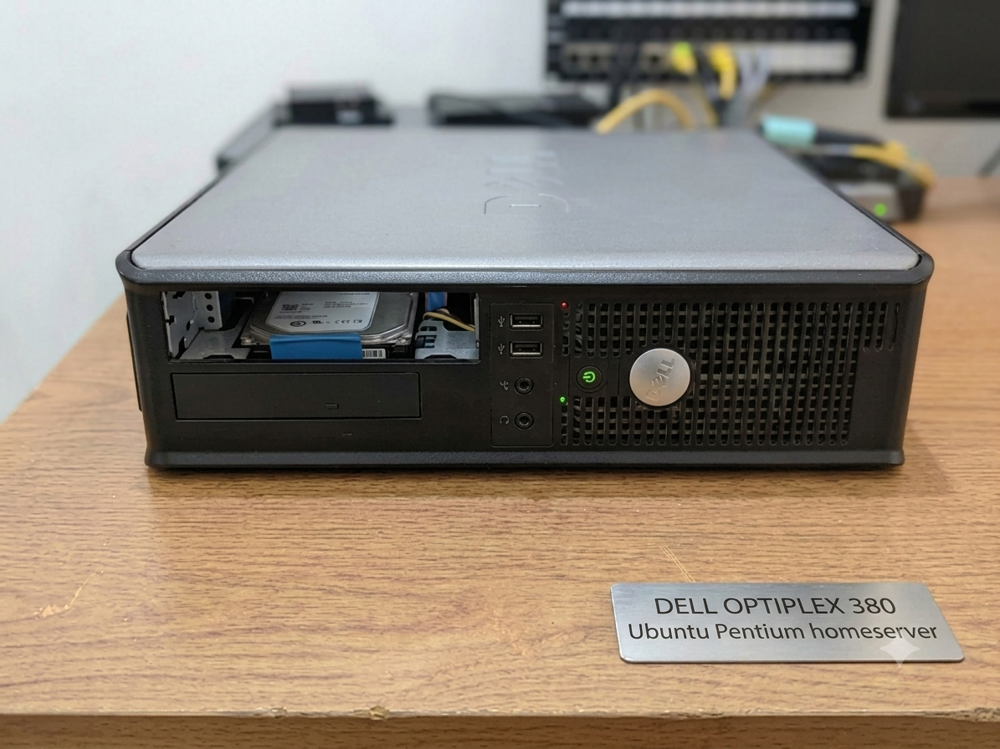
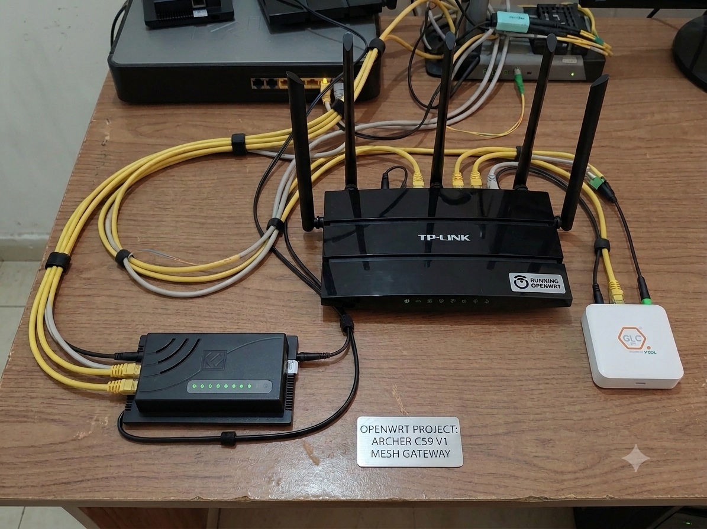
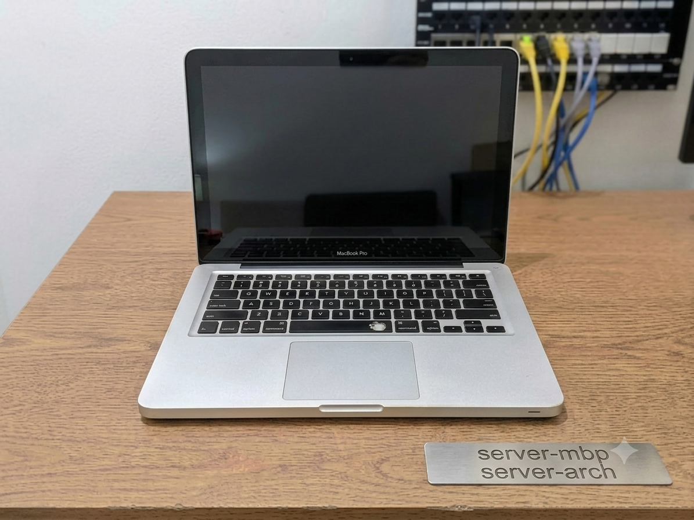

## Overview

This homelab began in 2022 with two machines destined for disposal — one running an unpatched, sluggish Windows 7 installation, the other on Windows XP. Over the following years they were rebuilt into the backbone of a self-hosted personal cloud providing file storage, media streaming, and database services, all securely reachable from anywhere and without any recurring subscription cost.

The core of the project was never the software itself, but the infrastructure problems that surface when running services from a residential connection: dynamic addressing, CGNAT, and exposing services to the internet without compromising the local network.

*The `pentium` host — a recovered Dell OptiPlex running Ubuntu Server.*

## From recovered hardware to a NAS

The first machine — a Pentium E5400 with 2 GB of RAM and a 500 GB HDD — was cleaned, re-pasted, and restored to working condition. After an initial period as a Linux learning environment, it was provisioned as a **NAS running Ubuntu 24.04 LTS**.

The first milestone was a working **Samba** deployment, configured from scratch over several iterations. It provided network file storage at transfer speeds well beyond the available internet bandwidth, and established a practical understanding of how traffic behaves within a private LAN. A local **Plex** server followed shortly after.

## The CGNAT constraint

Enabling SSH and file access from outside the network surfaced two obstacles. The first was a **dynamic local IP**, which required an `arp-scan` or `nmap` sweep to locate the server on each session — a problem that led to adopting OpenWrt for static DHCP leases by MAC address (documented separately below), and, in parallel, into network security: packet captures, WPA2/WPA3, and hash cracking with wordlists.

The second, and more significant, was that the connection operated behind **CGNAT**, making conventional port forwarding unviable.

*The home network rack — the Archer C59 v1 running OpenWrt sits at its center.*

## Resolution: Cloudflare Tunnel and SSH hardening

The constraint was resolved with **Cloudflare Tunnel**. Reusing the domain originally purchased for this portfolio, a subdomain was pointed at the server's SSH port, making the host reachable from the WAN despite CGNAT. The deployment was then hardened: SSH was moved off its default port, with **key-only authentication** and passwords disabled entirely.

This established a foundation for hosting additional services with appropriate access controls — databases, Plex, and ultimately **Jellyfin exposed on a dedicated subdomain**, paired with `yt-dlp` for a self-hosted music library supporting lossless FLAC. The complete Cloudflare Tunnel configuration was documented as a reusable runbook.

## Server fleet

The homelab currently comprises three machines, each assigned to a specific role:

- **`pentium`** — the recovered Dell OptiPlex on **Ubuntu Server**; the original NAS and the primary always-on host (Samba, Jellyfin, Plex, Cloudflare Tunnel).
- **`server-sempron`** — the former Windows XP machine, rebuilt on **Debian Trixie**. Single core, 512 MB of RAM, and a 20-year-old disk with roughly 1,000 hours of use — a demonstration that durable hardware paired with a lean, secure OS remains viable. Operates as a hardened personal cloud accessible only via SSH forwarding.
- **`server-mbp`** — a 2011 MacBook Pro on **Arch Linux**, selected for its SSD and 10 GB of RAM. Serves as the high-agility node, running a PostgreSQL and Redis stack in **Docker Compose** for a collaborative database project.

*`server-mbp` — a 2011 MacBook Pro running Arch Linux as the high-agility node.*

## Outcome

This is the project I consider most representative of my work, as every problem and its solution were arrived at independently. Samba shares, static leasing, working around CGNAT, SSH hardening, and containerizing a database stack were each problems encountered, researched, and resolved directly — and collectively they are where networking, Linux administration, and security became day-to-day practice rather than theory.
